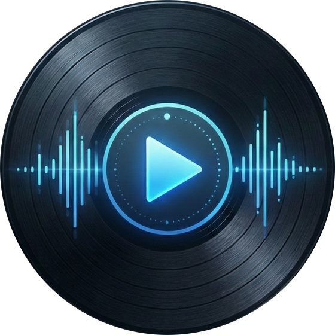

# sautiflow



Sautiflow is a cross-platform audio playback and processing engine for Dart and Flutter, powered by the C++ miniaudio library. It provides a high-level API for playlist management, gapless transitions, audio effects, and real-time status updates, all accessible via Dart FFI. Sautiflow supports native targets including Windows, Linux, Android, iOS, and macOS. Audiophiles and developers can leverage Sautiflow for building rich audio applications with advanced playback and processing capabilities.

## Features

- Playlist engine (set/add/insert/remove/move)
- Gapless transitions between tracks
- Audiophile-grade resampling algorithms powered by `libsamplerate` (SRC Sinc Best/Medium/Fastest, ZOH, Linear)
- Play/pause/stop/seek/next/previous/jump
- Shuffle + loop modes (`off`, `all`, `one`)
- FX chain: gain, pan, stereo widening, EQ (3-band), multiband EQ, reverb, low-pass, high-pass, band-pass, delay, peak EQ, notch, low-shelf, high-shelf
- Pollable player status and stream updates
- Native targets: Windows, Linux, Android, iOS/macOS

## Audio Formats & Quality

Sautiflow is built with audiophile-grade fidelity in mind. It handles different audio formats natively within its C++ engine to provide the best possible acoustic reproduction:

- **Lossy Formats (MP3, AAC, OGG etc.)**: These formats are inherently compressed. Upon playback, Sautiflow **upscales/upsamples** the decoded bitstream internally (in 32-bit floating point math) ensuring that DSP operations—like EQ, reverb, and spatial width—have plenty of headroom and do not clip or introduce artificial artifacts typical of low-resolution math.
- **Lossless Formats (FLAC, WAV, ALAC, etc.)**: These are mapped and processed **raw**. Sautiflow does **not** dynamically upscale them to guess lost data (since nothing is lost). It maintains their pristine bit-perfect original depth into the DSP chain. If the file's sample rate doesn't match your device's native hardware rate (e.g., trying to play an 88.2kHz FLAC file on a 48kHz output device), Sautiflow will employ high-fidelity **resampling** transparently using `libsamplerate` to perfectly match your hardware, avoiding quality loss while retaining bit-depth fidelity.

## Public Dart API

Import:

```dart
import 'package:sautiflow/sautiflow.dart';
```

### Example (playlist + controls)

```dart
final player = MiniAudioPlayer();
player.init();

final playlist = <AudioSource>[
  AudioSource.uri(Uri.parse('https://example.com/track1.mp3')),
  AudioSource.uri(Uri.parse('https://example.com/track2.mp3')),
  AudioSource.uri(Uri.parse('https://example.com/track3.mp3')),
];

player.setAudioSources(
  playlist,
  initialIndex: 0,
  initialPosition: Duration.zero,
  useLazyPreparation: true,
);

player.play();
player.seekToNext();
player.seekToPrevious();
player.seekTo(const Duration(seconds: 0), index: 2);
player.setLoopMode(LoopMode.all);
player.setShuffleModeEnabled(true);

player.addAudioSource(AudioSource.uri(Uri.parse('https://example.com/new.mp3')));
player.insertAudioSource(1, AudioSource.uri(Uri.parse('https://example.com/ins.mp3')));
player.removeAudioSourceAt(3);
player.moveAudioSource(2, 1);

player.setEqEnabled(true);
player.setEq(low: 1.2, mid: 1.0, high: 1.1);
player.setReverbEnabled(true);
player.setReverb(mix: 0.2, feedback: 0.6, delayMs: 100);

// Advanced filters / parametric shaping
player.setBandpass(enabled: true, cutoffHz: 1000, q: 0.8);
player.setPeakEq(enabled: true, gainDb: 3.0, q: 1.0, frequencyHz: 2500);
player.setNotch(enabled: true, q: 10.0, frequencyHz: 60);
player.setLowshelf(enabled: true, gainDb: 4.0, slope: 1.0, frequencyHz: 100);
player.setHighshelf(enabled: true, gainDb: 2.5, slope: 1.0, frequencyHz: 10000);
```

## Native build outputs

Expected library names by platform:

- Windows: `audio_engine.dll`
- Linux/Android: `libaudio_engine.so`
- macOS: `libaudio_engine.dylib`
- iOS: statically linked (`DynamicLibrary.process()`)

## Flutter plugin structure

This package is configured as a Flutter FFI plugin in [pubspec.yaml](pubspec.yaml) with:

- Android (`ffiPlugin: true`)
- iOS (`ffiPlugin: true`)
- Linux (`ffiPlugin: true`)
- Windows (`ffiPlugin: true`)

Platform native build configs are included:

- [android/src/main/cpp/CMakeLists.txt](android/src/main/cpp/CMakeLists.txt)
- [ios/sautiflow.podspec](ios/sautiflow.podspec)
- [linux/CMakeLists.txt](linux/CMakeLists.txt)
- [windows/CMakeLists.txt](windows/CMakeLists.txt)

## Build scripts

- Windows: [tool/build_windows.ps1](tool/build_windows.ps1)
- Linux: [tool/build_linux.sh](tool/build_linux.sh)
- Android (NDK): [tool/build_android.sh](tool/build_android.sh)
- Android (NDK, PowerShell): [tool/build_android.ps1](tool/build_android.ps1)
- Apple (iOS + macOS): [tool/build_apple.sh](tool/build_apple.sh)

## Packaging notes

For Flutter app integration, keep native artifacts available in app/plugin output:

- Android: `android/src/main/jniLibs/<abi>/libaudio_engine.so`
- iOS: link `audio_engine.xcframework` in Xcode/Podspec
- Windows: place `audio_engine.dll` next to executable
- Linux: ship `libaudio_engine.so` with app bundle and ensure loader path

### Android native network streaming (libcurl)

Android now attempts to enable native URL streaming by default.

- If `libcurl` is found (explicit path or bundled per ABI), native network streaming is enabled.
- If not found, Android build continues and falls back to non-native URL handling (no build break).

Optional overrides (Gradle project properties):

- `MINIAUDIODART_ENABLE_CURL=ON|OFF`
- `MINIAUDIODART_CURL_INCLUDE_DIR=/path/to/include`
- `MINIAUDIODART_CURL_LIBRARY=/path/to/libcurl.a` (or `.so`)
- `MINIAUDIODART_CURL_LIBRARY_DIR=/path/to/abi-parent`
- `MINIAUDIODART_CURL_EXTRA_LIBS=ssl;crypto;z` (optional static dependency chain)

### Recommended Android setup (static per ABI)

Use static `libcurl.a` per ABI to keep plugin packaging simple (single `libsautiflow.so`).

Expected layout:

- `native/android/include/` (curl headers)
- `native/android/armeabi-v7a/libcurl.a`
- `native/android/arm64-v8a/libcurl.a`

The Android Gradle configs are aligned to arm ABIs by default (`armeabi-v7a`, `arm64-v8a`).
If you need emulator ABIs (`x86`, `x86_64`), add matching prebuilt curl artifacts and expand ABI filters.

For release/legal packaging, include third-party attributions from
[THIRD_PARTY_NOTICES.md](THIRD_PARTY_NOTICES.md).

## Example

See [example/main.dart](example/main.dart) for a complete usage sample.

Leave a star if you find this project useful! ⭐

Project inspired by `just_audio` for simplicity and familiarity of API design, but built on a custom native engine with a focus on advanced audio processing features and real-time capabilities.
